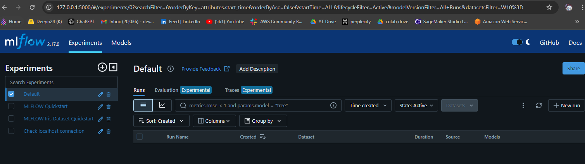
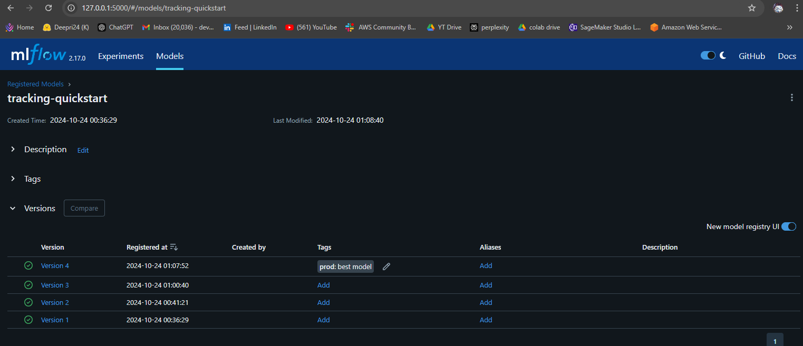

# Getting Started With ML Project Using MLflow

This project demonstrates how to set up, train, and log a machine learning model with MLflow, track experiments, and use MLflow’s features to register models and perform inference.

## Steps to Follow

### 1. Install MLflow
- Install MLflow in your environment using pip.

### 2. Start a Local MLflow Tracking Server
- Set up and start an MLflow tracking server on your local machine.

### 3. Load Dataset and Train a Model
- Use the Iris dataset to train a **Logistic Regression** model.
- Split the dataset into training and testing sets.

### 4. Track Your Experiment in MLflow
- Create a new MLflow experiment and start logging:
  - Hyperparameters
  - Model accuracy
  - Model signature (input-output schema)
- Log the trained model to MLflow.

### 5. Register the Model in MLflow
- Register your trained model with MLflow’s model registry.

### 6. Train and Log Additional Models
- Modify hyperparameters to train additional models.
- Log these models as part of new MLflow runs for comparison.

### 7. View Experiment Results in the MLflow UI
- Open the MLflow UI to view all experiment runs, compare metrics, and review model performance.

### 8. Perform Inference with a Logged Model
- Use MLflow’s `pyfunc` to load the registered model for inference.
- Validate and test the model by feeding new input data.

### Output screenshots 

